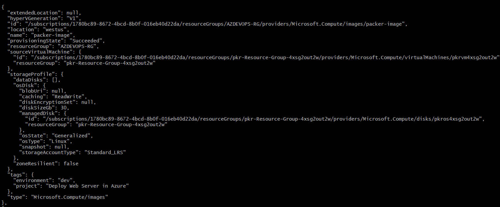
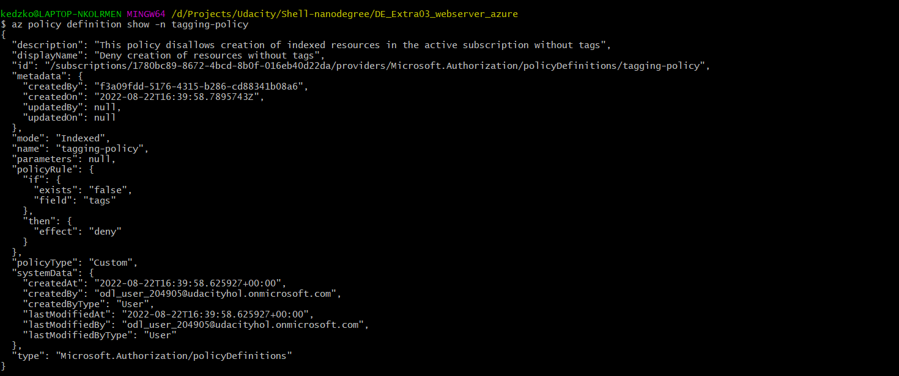
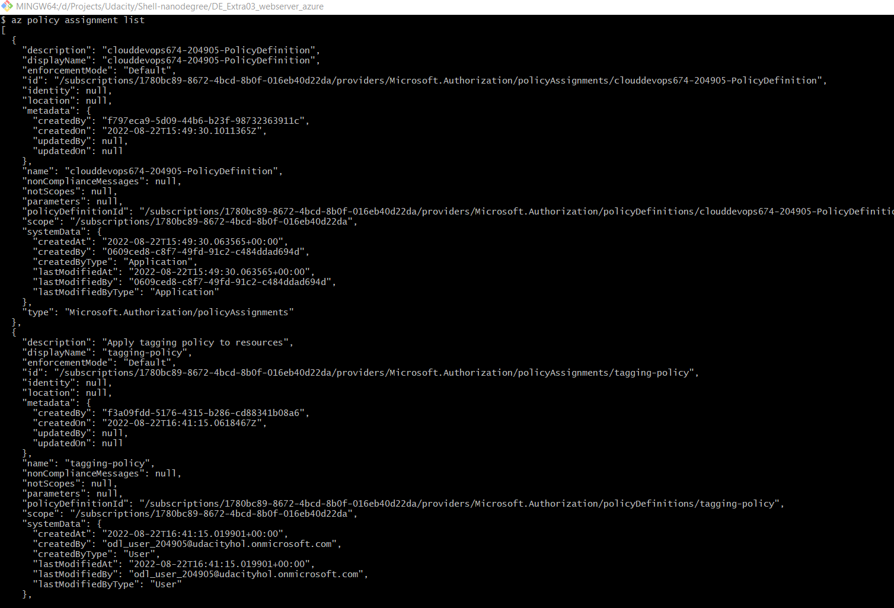
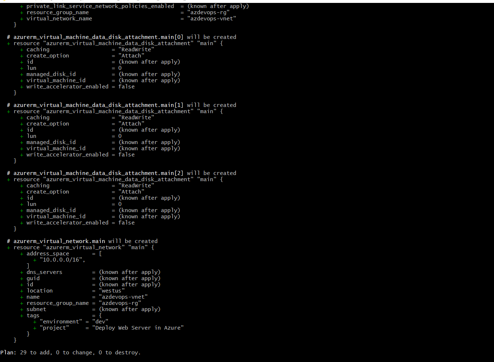
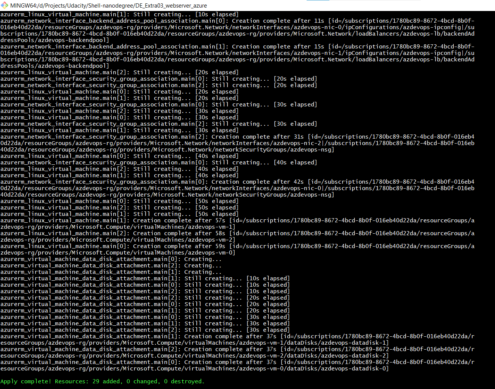

# Azure Infrastructure Operations Project: Deploying a scalable web server in Azure

### Introduction
This project uses a Packer template and a Terraform template to deploy a customizable, scalable web server in Azure.
The Packer template generates Virtual Machine images which are provided as input to Terraform to generate several virtual machines
according to the Packer-generated Image.
To follow best practices of security, passwords, tags, authentication mechanisms are not provided directly in the code templates,
but are defined as variables, either being read through environment variables (packer) or the variable terraform file, vars.tf

### Getting Started
1. Clone this repository

2. Create a service principal for authentication with packer and Terraform.  
Substitute your subscription ID below.

```
az ad sp create-for-rbac -n "PackerApp" --role Contributor --scopes /subscriptions/{subscriptionId}
```

3. Store the generated client id/application id, subscription id, and client secret in environment variable. These will be used to authenticate packer. For terraform we authenticate via Azure CLI Login. Use az login to open a browser window for authentication.

4. Azure has to be configured as a provider for Terraform before it can be used to create resources. Run the command 
```
terraform init 
``` 
within the repo folder to install the Azure provider.

### Dependencies
1. Create an [Azure Account](https://portal.azure.com) 
2. Install the [Azure command line interface](https://docs.microsoft.com/en-us/cli/azure/install-azure-cli?view=azure-cli-latest)
3. Install [Packer](https://www.packer.io/downloads)
4. Install [Terraform](https://www.terraform.io/downloads.html)

### Instructions
1. Run the script az_policy_def.sh, which contains a command to create a custom policy definition that disallows creation of non-tagged resources.  

2. The script creates the policy definition after which it still has to be applied. Run the command
```
az policy assignment create --policy tagging-policy --description "Apply tagging policy to resources" \
    --display-name "tagging-policy" --name "tagging-policy"

``` 
to assign the tagging policy.

3. Modify the server.json packer template to change image SKU, OS or configuration. The managed image name here will be used with terraform to create virtual machine resources.  
4. Make sure the environment variables ARM_CLIENT_ID, ARM_SUBSCRIPTION_ID, ARM_CLIENT_SECRET are set. To deploy terraform using a service principal, the variable ARM_TENANT_ID will also need to be set and referenced in main.tf.
5. Run packer build server.json to have packer create the base Virtual Machine Image. Make sure you are authenticated (via service principal) before running the command.  
6. Modify the values in vars.tf to change tags, environments, resource name prefix, IP address ranges, passwords and the number of
virtual machines to be created.
7. Run the command 
```
terraform plan -out "solution.plan"
```
to preview the actions terraform will take to generate the resources. 
8. Apply the plan with 
```
terraform apply "solution.plan"
``` 

### Output  

The output of the packer template is a VM image, created in the resource group specified in server.json. 
This image configuration can be view with
```
az image list
```
which shows all the images available in the resource group.



The output of the policy definition script is 
  

The policy assignment command gives us  
  

After the Terraform template is ready, running terraform plan gives us
  

Deploying the Terraform Plan should produce
  


### Notes
- Ip Addresses, tags, and resource prefixes have been kept configurable via environment variable as they help keep track  
of resources specific to a project/deployment.  
- Credentials have also been stored in environment variables as they are not to be referenced directly in code templates.
